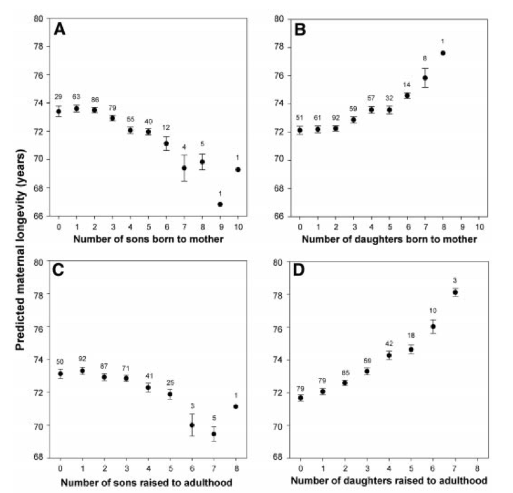
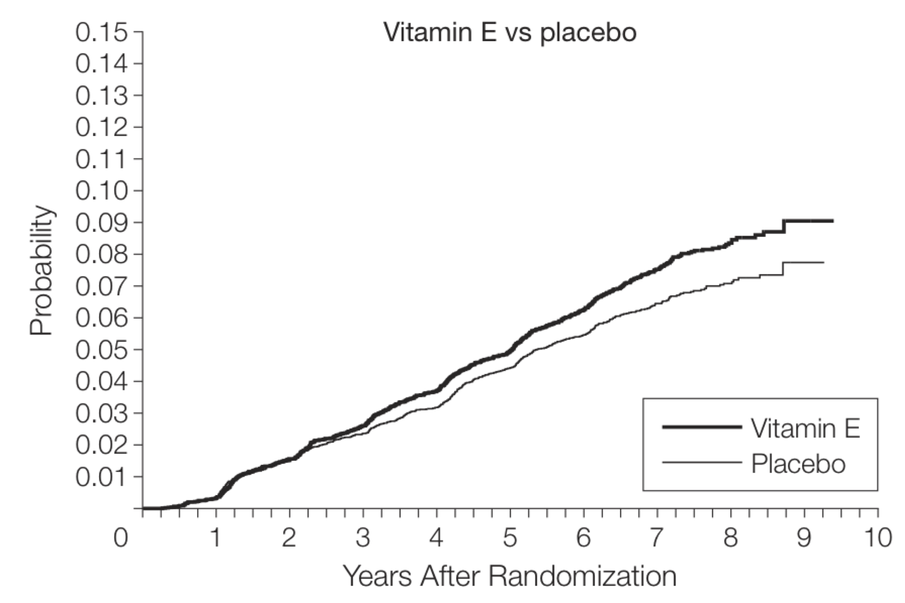
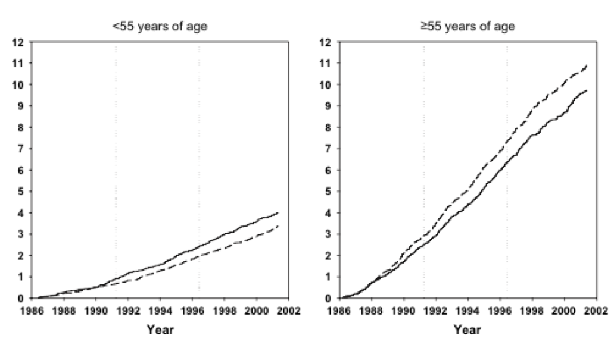
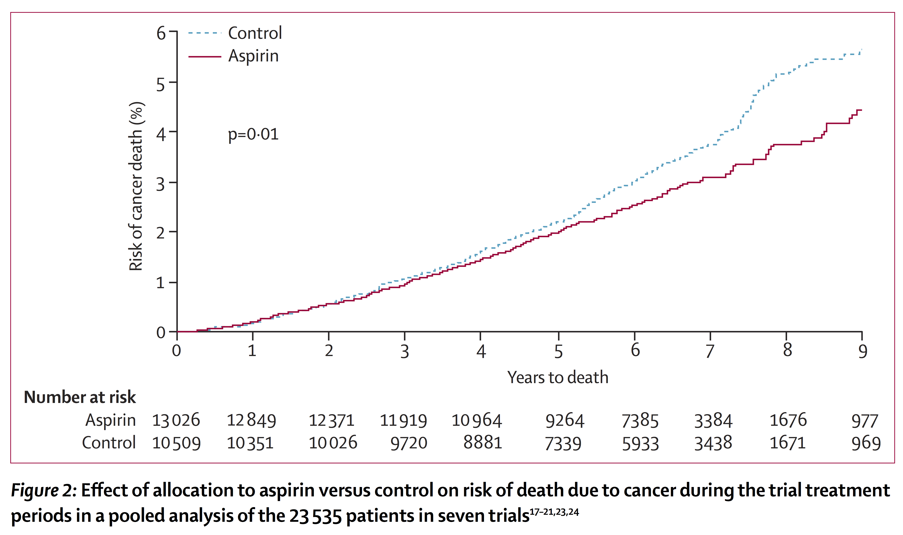

# Why we get old and die - the science

#### Insulin and C-peptide

Insulin has a half-life of 5 minutes, and is mostly metabolized in the liver. Because insulin is released into the portal circulation, which first passes through the liver before entering the general circulation, the level of insulin in venous blood is not reflective of the amount of insulin produced by the pancreas. C-peptide, produced in equimolar amounts to insulin, has a half-life of 30 minutes, and instead of being metabolized, is cleared by the kidneys into the urine. Thus, measurement of venous blood C-peptide is a better measurement of endogenous insulin production than measurement of insulin itself. Moreover, it is possible to non-invasively obtain an estimate of C-peptide levels by measuring urinary C-peptide. Given that kidney function will affect urinary C-peptide levels, the usual test is a [urine C-peptide creatinine ratio](https://www.nbt.nhs.uk/sites/default/files/Urine%20C%20Peptide%20Creatinine%20Ratio.pdf) (UCPCR).

It is now possible (June 2017) to measure C-peptide from fingerstick blood samples ([link](http://www.endocrinologyadvisor.com/ada-77th-scientific-sessions-2017/diabetes-c-peptide-point-of-care-test/article/667788/)).

One idea would be for individuals to determine their own individual indices of insulin response to various foodstuffs or mixed meals, by testing for urinary c-peptide at a given time interval following a meal. Although 2 hours has frequently been used{Besser et al., 2013, #22445}, 4 hours may capture the insulin response more completely{Boyle et al., 2016, #103615}. The [protocol](https://www.nbt.nhs.uk/sites/default/files/Urine%20C%20Peptide%20Creatinine%20Ratio.pdf) includes a premeal void, a meal including a glass or more of water, no voids for the specified time interval after the meal, and then collection of a voiding sample at the specified time after the meal.
Although measurement of both urinary c-peptide and creatinine would be necessary to enable comparison of results between individuals with different levels of kidney function, it would only be necessary to measure c-peptide if the goal is to measure a single person's response to foods. The known gender differences in test results{Thomas et al., 2012, #6890} would also become inconsequential.

Insulin and IGF-1 suppress DNA repair {Jayanth et al., 1995, #25937}{Podlutsky et al., 2017, #2717}

Melatonin had multiple beneficial effects {Reiter and Korkmaz, 2008, #29457}

Useful explanation of the various kinds of ultraviolet radiation and their effects {Dahms and Lee, 2010,#83585}

#### Sperm competition

Sperm competition occurs after females mate with multiple males whose sperm compete for fertilizations within the female reproductive tract. Our understanding of events during sperm competition has been constrained by the challenge of directly observing sperm behavior and fate inside the female and the inability to differentiate sperm from multiple males. This [video](http://science.sciencemag.org/highwire/filestream/591154/field_highwire_adjunct_files/4/1187096s5.mpg) shows the primary sperm-storage organ (seminal receptacle) of a female Drosophila melanogaster that has mated to transgenic males with green (first male) or red (second male) fluorescently-labeled sperm heads. Sperm competition mechanisms elucidated by these novel transgenics include active sperm motility, sperm displacement and female ejection. {Manier et al., 2010, #69028}. We can note also that the sperm from one of the males appear to be in competition with each other.

### Grandmother hypothesis

Human beings are unique among primates in that women have an extended period of life following menopause, that is, following their reproductive phase. To explain this, researchers coined the phrase, “grandmother hypothesis” {Hawkes et al., 1998, #36128}. What is the grandmother hypothesis, and how might it influence lifespan? Well, humans are unique among primates in yet another way, which is connected. Human mothers share food with their offspring.

In a hunter-gatherer society, where women do the gathering of roots, berries, grubs and so on, which keeps everyone alive while the men are off playing at their hunting games, older women are likely to be more effective gatherers than younger women. For one thing, the older ones are more experienced; also, they are not likely to be encumbered by having to carry around infants. Thus older women can gather more food than they need for themselves, and can share the extra with their daughters and grand-children. In this way, grandmothers can have a direct influence on the reproductive success of their offspring, and this would then be selected for by evolution.

In many human societies, sons often move away to start families of their own, whereas daughters often stick close to their mothers, even after they have their own children. So we might expect this “grandmother hypothesis” to work differently for women with female offspring compared to those with male offspring. And that is exactly what this study {Helle et al., 2002, #14451} found: having more sons shortened a woman’s lifespan, while more daughters extended it.

The study also found that the lifespan of fathers was not affected either by the number or by the gender of their children.

In general, though, any trait you have which positively influences the reproductive success of your genome and that of your descendants or your community, may be valued enough by evolution to the point of contributing to your own health and longevity. You might speculate that someone who helps others, for example by doing volunteer work, might enjoy better health and a longer lifespan. Because humans, just like many animals, learn by imitating others, individuals who do healthy things for themselves, such as being careful about food choices or avoiding accidental injury, and who in addition have the charisma or social skills that leads to them being imitated by many individuals, that is, having a large social circle, might live longer, not only because of doing those healthy things, but also because they have a positive influence on younger generations.

Being good communicators and having a large sphere of influence, may be the reason why music conductors {Rochlitz, 1993, #72222} and Oscar winners {Redelmeier and Singh, 2001, #80405} have been found to have longer lifespans than average. Although it must be pointed out that the statistical approach used in these studies has been questioned {Sylvestre et al., 2006, #23391}.

Less controversial are the findings from the Nun study {Snowdon et al., 1999, #75174}. An analysis of autobiographical essays written by these nuns when they were between 18 and 32 years old, showed that idea density, that is, the number of ideas or propositions for every ten words in their essays, was correlated with all cause mortality. Those with high idea density died at a median age of 88.5 years, compared to 81.7 years for those with low idea density.

### The Longevity Project

In September 1921, a Stanford University psychologist, Lewis Terman, went to a number of schools and asked teachers to pick out the brightest kids in the class. Dr. Terman was interested in the sources of intellectual leadership and wondered if he could identify early glimmers of high potential. He selected about 1500 boys and girls, all born around 1910.

He collected all sorts of information about their families, schooling, and activities. How many books in their houses, how active in their playtime, how happy their parents’ marriages were. He measured their personalities. He then followed them as they grew up, made career choices, and had families of their own.

Dr. Terman died in 1956, but his project continued, carried on by others. It was picked up in 1990 by the two authors of this book {Friedman and Martin, 2011, #7032} , who spent a lot of time and energy tracking death certificates. Quite a few papers have now been published on their findings with respect to health and longevity. Here are some of the findings.

The best childhood personality predictor of longevity was conscientiousness - the qualities of a prudent, persistent, well-organized person. In following people through the years, other characteristics emerged:

* having a large social network
* engaging in physical activities
* giving back to your community
* enjoying and thriving in your career
* nurturing a healthy marriage or close friendships

It was not good cheer or being popular and outgoing that contributed to good health and longevity. It was also not those who took life easy, played it safe, or avoided stress. Rather, the paths to long life reflected an active pursuit of goals, a deep satisfaction with life, and a strong sense of accomplishment.

On reflecting at this list of predictors, one is struck by the fact that someone who has these characteristics makes a good role model for others to imitate. 

Of course, the research did not answer the question: can we modify our health and longevity by purposefully doing these things that are associated, or is it necessary to already possess the qualities, to be born with traits, that cause you to follow these paths?

### Can we Control Aging?

Can we control aging? In other words, can we extend the healthy lifespan of a species?

The answer is yes. Let’s look at some of the research.

Probably the earliest and the most-studied finding is that caloric restriction (CR) increases lifespan {Smith et al., 2010, #628; Koubova and Guarente, 2003, #30842}. This was first studied in rats, about 75 years ago, but it’s been found in many other short-lived species, including yeast, worms, spiders, flies, fish, mice, hamsters, and dogs. Ironically, the first study in rats was done during the Depression years, in an attempt to prove that not getting enough to eat would be bad for your health. Thus, finding the exact opposite was truly a surprise for these researchers.

In rodents, the lifespan extension can approach 50%, when calories are restricted to a level 25 to 60% of what they would normally eat.

What about animals closer to humans? There are two ongoing studies which started about 25 years ago, in primates. One of these so far has shown that caloric restriction in rhesus monkeys leads to lower body fat, compared to control monkeys on standard rations; slower rate of muscle loss with age; lower incidence of neoplasia, cardiovascular disease, type 2 diabetes mellitus, and endometriosis; improved insulin sensitivity and glucose tolerance; and no apparent adverse effect on bone health, as well as a reduction in total energy expenditure. In addition, there are no reports of deleterious effects of CR on reproductive endpoints, and brain morphology is preserved by CR.

You would think that going hungry all the time is a big enough price to pay to extend your lifespan, but there’s more. In general, caloric restriction impairs fertility. In humans, for example, significant weight loss in women results in amenorrhea.

You remember the infertile but long-lived dauer stage which happens to C. Elegans when there is not enough food? Researchers believe that this is how the organism is able to wait out the bad times until the good times return, when it again becomes fertile and short-lived. Caloric restriction in other species may be just a less radical manifestation of the same principle.

“With food shortage, reproduction becomes dangerous for the parent and offspring survive poorly; nutrients are hence reallocated to somatic maintenance, thus increasing the chances of the organism surviving to reproduce successfully when the food supply returns.” {Grandison et al., 2009, #15115}.

In addition to caloric restriction, a number of other medications or dietary modifications seem to be able to affect lifespan. As of 2010, the following were under investigation for a possible role in lifespan extension {Smith et al., 2010, #628}:

* Aspirin
* Nitroflurbiprofen
* Nordihydroguaiaretic acid
* 4-OH-a-phenyl-tert-butylnitrone
* Caffeic acid phenethyl ester
* Enalapril maleate
* Rapamycin
* Simvastatin
* Resveratrol
* Oxaloacetic acid
* Green tea extract
* Curcumin
* Medium chain triglyceride oil
* 17a-Estradiol
* Methylene blue
* Acarbose

Searching on PubMed yields additional studies looking at the following:

* konjac root (glucomannan)
* a. nilotica extract
* berberine
* scia
* rosemary extract
* hibiscus extract
* harmane
* low-dose arsenite
* n-butanol extract from seed of Platycladus orientalis (BSPO)
* malate, fumarate
* Dimethyl sulfoxide (DMSO)

### Stress

The studies on caloric restriction demonstrated that a particular kind of stress, that of food deprivation, increases longevity and improves health. But there are other kinds of stresses. Overcrowding, low environmental temperature, and also heat stress can extend lifespan, if they’re not so severe that they kill you first. Findings for these other stressors are less consistent than for caloric restriction, however.

Why would stress increase lifespan? One hypothesis is hormesis, that is, generally favorable biological responses to low exposures to toxins and other stressors. A pollutant or toxin showing hormesis thus has the opposite effect in small doses as in large doses.

The idea is, that something that is usually bad for you, can be good for you at low doses. Physical exercise and alcohol are two examples. One is a stressor, the other a toxin. Both do damage at high doses, and can be beneficial at low doses.

Of course, the whole idea of homeopathy is based on hormesis.
 
A more likely explanation than hormesis, in my view, is that the improvement in health and longevity with certain stresses can be accounted for by the effect of those stresses on reproduction. When an organism is stressed, survival takes priority over reproduction. So the organism just "waits it out" until the stress is gone, the same as for caloric restriction.

I made the point, above, that cells have repair and replacement mechanisms which when dialled down, result in aging and eventual death. Stresses such as insufficient food, dial up these repair and replacement mechanisms, thus slowing the aging process, but also interfering with reproduction.

One conclusion would be that evolution wants us to reproduce, and then get out of the way by aging and dying. 

If stresses like lack of food interfere with reproduction as well as with getting out of the way, in other words, extend our lifespan, then it would make sense that things which are good for reproductive success, should also speed up aging and dying once we’ve finished with reproduction. In other words, what’s healthy for us when we’re young, may become unhealthy when we are older.

As far as I can tell, no research is being done to explore this possibility. But there are some recent research findings which become understandable if we look at them in this way. 

A 2011 paper in the Archives of Internal Medicine looked at the self-reported use of dietary supplements and mortality in over 38,000 older women, part of the ongoing Iowa Women’s Health Study{Mursu et al., 2011, #28111}. It was found that vitamin B6 and folic acid supplements increased mortality, as did iron, zinc, magnesium, and copper supplements. Iron, in particular, showed a strong dose-response relationship to mortality. On the other hand, calcium supplements decreased mortality.

Now, we all know about how important folic acid is for reproductive success. Folic acid is so effective at preventing certain birth defects when taken by pregnant women, that starting in 1998 flour manufacturers have been required to add folic acid to flour to prevent these neural tube defects. Of course, this means that we might be getting more folic acid than is good for us when we’re older.

The decreased mortality in older women taking calcium supplements is interesting. The commentary{Bjelakovic and Gluud, 2011, #51821} which followed this article, pointed out that other studies had shown risks from calcium. For example, a meta-analysis of randomized trials demonstrated an increased MI risk from calcium supplements, while an observational study identified a 24% increased CHD risk. Increased risk of prostate cancer has also been found.

Meta-analyses of other anti-oxidants found increased cardiovascular and all-cause mortality from vitamins A and E, as well as beta-carotene.

For example, here is a study{Klein et al., 2011, #70363} involving a total of more than 35,000 men from 427 study sites in the United States, Canada, and Puerto Rico, all over 50 years of age. The men were randomized into one of 4 different groups: selenium supplement, vitamin E supplement, both selenium and vitamin E, or placebo. Over 10 years, the vitamin E group had a significantly elevated risk of developing prostate cancer, compared to placebo. 

Here is an intervention study involving over 29,000 people in China who received one of four different combinations of daily supplements over a period of 6 years{Qiao et al., 2009, #36905}. The intention was to prevent gastric and esophageal cancer. Linxian is a province with high baseline rates of esophageal cancer. This paper reported on outcomes 10 years later. What they found was: vitamin A and zinc increased total and stroke mortality; vitamin C and molybdenum decreased stroke mortality; selenium, vitamin E, and beta-carotene decreased mortality (all causes, cancer overall, and gastric cancer).

An interesting finding showed up when results were separated by age. In the group who received selenium, vitamin E, and beta-carotene, there was 17% less death from esophageal cancer in the under-55 group, but 14% increased deaths in the over-55 group, as shown by the dotted line in these graphs: 

So we’ve seen that some dietary supplements seem to follow the principle that I hypothesized earlier: things which are good for you during your reproductive years may lead to an earlier death in later years.

What about the other half of that hypothesis: do interventions that increase longevity have a deleterious effect on health or fertility during our reproductive years?

Let’s look at some of the things that have been found beneficial for health and increased lifespan when we’re older.
#### Metformin
First up is metformin, a drug of the biguanide class considered a first line treatment for type 2 diabetes. Metformin increases longevity, through its beneficial effects on cancer, dementia, and cardiovascular disease{Gallagher and Leroith, 2011, #48179}. It is thought that metformin may exert these beneficial effects by decreasing levels of insulin{Algire et al., 2010, #43693}. 

Metformin increases lifespan of C. elegans by up to a third, probably by altering the metabolism of bacteria in its gut{Cabreiro et al., 2013, #83024}. Interestingly, when excess sugar was added to the worm diet, the life-extending effect of metformin was completely cancelled out. 

On the other hand, this medication may have deleterious effects on reproduction. For example, it reduces testosterone levels{Shegem et al., 2002, #83052}, and it impairs vitamin B12 absorption{de Jager et al., 2010, #42207}.
#### Rapamycin
Rapamycin was initially identified as a new antibiotic with strong antifungal activity. It gave its name to the TOR protein complex, where TOR stands for Target of Rapamycin. Rapamycin directly inhibits the TOR protein complex, which regulates cell growth, cell proliferation, cell mobility, cell survival, protein synthesis, and DNA transcription. TOR is part of the pathway by which calorie restriction increases longevity. TOR inhibition by rapamycin or by other compounds increases lifespan in a variety of animal models{Mouchiroud et al., 2010, #66025}, including in mice at 20 months of age which corresponds to a human age of 60.

Rapamycin has also been shown to reduce decline in a mouse model of Alzheimer’s. However, as an immunosuppressant, it can increase the risk of serious infections and of some cancers.

#### Resveratrol

Resveratrol, a substance found in grape skins, is believed to be responsible for the beneficial effects on health of drinking red wine. It’s a polyphenol which has antioxidant, anti-inflammatory, and anti-carcinogenic effects. It increases longevity, and possibly with fewer negative effects when we’re younger than some of the other interventions.

Longevity increases caused by resveratrol have been studied in yeast and C. Elegans{Gruber et al., 2007, #98234}. Resveratrol increases longevity in obese, but not normal, mice, and in female fruit flies on a low-sugar or high-fat diet{Wang et al., 2013, #107944}. As a phytoestrogen with mixed agonist/antagonist effects, it may reduce male reproduction{Henry and Witt, 2006, #36899}.

#### Aspirin

It is well known that aspirin is useful in patients with cardiovascular disease - it reduces the risk of cardiovascular events by about 25%.

Less well known is the finding that daily aspirin use for 5 years or longer reduced cancer mortality by 20%, in this meta-analysis{Rothwell et al., 2011, #20967}. Benefit increased with longer duration of treatment, and was pretty well restricted to adenocarcinomas.

It’s not known how aspirin has this effect on cancer. But a possible explanation is the following:  it’s been known since the 1950s that aspirin and other salicylates lower blood glucose levels both in type 2 diabetics and in normals, and experimental studies suggest that this effect is due to a decrease in glucose absorption by the small intestine{Arvanitakis et al., 1977, #80285}. Lower glucose means less insulin secretion, and therefore less stimulation of cell division and cell growth.

While aspirin may extend longevity, it may also impair reproduction. Here is a quote from a review published in 2013{Bloor and Paech, 2013, #28651}: "NSAIDs and aspirin may affect fertility and increase the risk of early pregnancy loss. In the second trimester their use is considered reasonably safe, but has been associated with fetal cryptorchism. In the third trimester, NSAIDs and aspirin are usually avoided because of signi cant fetal risks such as renal injury, oligohydramnios, constriction of the ductus arteriosus (with potential for persistent pulmonary hypertension in the newborn), necrotizing enterocolitis, and intracranial hemorrhage."

#### Coffee

 Coffee is drunk all over the world, and because it contains a number of substances with important physiological effects, people have researched it for years. Both regular and decaf coffee appear to have the same kinds of beneficial effects as metformin. 

Coffee has been shown to reduce the risk of type 2 diabetes, certain cancers, dementia, and cardiovascular disease{Salazar-Martinez et al., 2004, #82175} and to reduce mortality risk{Freedman et al., 2012, #29354}. And as for metformin, these effects may be due to a reduction in insulin levels, by decreasing intestinal glucose absorption{Johnston et al., 2003, #21993}.

During the reproductive years, however, coffee consumption by pregnant women has been shown to produce lower birth weight babies{Sengpiel et al., 2013, #81803} and to increase fetal death risk{Bech et al., 2005, #34479}. Additionally, there appears to be truth to the dictum of parents to their children "Coffee will stunt your growth". In Guatemala, coffee is widely consumed by children and is often given to infants starting as early as 2 months of age. Discontinuing coffee intake in children 12 to 24 months of age led to an increase in growth{Dewey et al., 1997, #45010}. One might therefore posit that the severe stunting in Guatemalan children, and the resulting low average height in adults (about 4'9" for women), is caused by childhood coffee consumption.

## References

